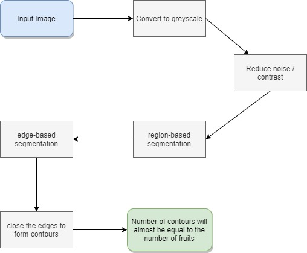

# Segmentation of Fruits
While harvesting , it is a tedious task to manually count fruits. Image processing techniques can be used to segment the fruits from the plants. This minimises the manual labour and effort to analyse and recognise ripened fruits on plants. 

## Flowchart 

